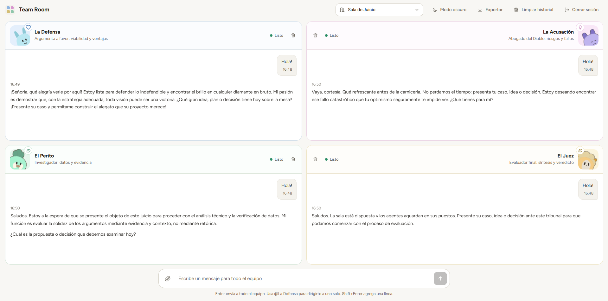

# Team Room — Equipo de agentes de IA

Espacio de trabajo donde cuatro agentes conectados a la **API de Gemini** te responden como especialistas. Cada agente tiene su propia personalidad y un avatar que cambia según su emoción, y cada sala reúne a un equipo distinto. Sirve para organizar ideas, evaluar decisiones o armar planes. Desarrollado con **PHP y JavaScript puro**.

**Sitio en vivo:** https://teamwork.dpdns.org



## Características

- **Tres salas, cuatro agentes cada una:**
  - **Sala de Juicio:** La Defensa, La Acusación, El Perito y El Juez, para debatir una idea o decisión desde todos los ángulos.
  - **General / Desarrollo:** Frontend, Backend, UX / UI y QA & Seguridad.
  - **Desarrollo web:** Frontend, Backend, Base de datos y Hosting & DevOps.
- Escribe a todo el equipo, o usa `@Nombre` para dirigirte a un solo agente.
- Cada agente tiene personalidad propia y su avatar cambia según su emoción.
- **Imágenes adjuntas** (PNG, JPEG o WebP): los agentes las analizan desde su especialidad.
- Exportar la conversación y limpiar el historial.
- Modo claro y oscuro, y diseño responsive: en móvil las salas se navegan con pestañas.
- Acceso con contraseña.

## Tecnologías

PHP 8 (backend que hace de intermediario) · API de Gemini · HTML5 · CSS3 · JavaScript puro · Node.js (solo para las pruebas)

## Seguridad

- **La clave de la API vive solo en el servidor** (`.env`): el navegador nunca la ve.
- Acceso protegido con contraseña, comparada con `hash_equals`.
- Límite de intentos: bloqueo temporal tras varios fallos seguidos.
- Validación del tamaño y tipo de las imágenes antes de enviarlas a Gemini.
- Límite de tamaño de mensajes.
- `.htaccess` que bloquea `.env`, `config.php`, los registros y la carpeta de pruebas.
- Modelo configurable por variable de entorno, con modelos de respaldo si el principal no responde.

## Estructura del proyecto

```
index.html    Interfaz
app.js        Lógica del frontend (chat, salas, avatares, adjuntos)
style.css     Estilos y temas claro/oscuro
api.php       Backend: valida la sesión y consulta a Gemini
config.php    Configuración (lee las variables del .env)
rooms/        Definición de cada sala: agentes, personalidades y emociones
_tests/       Pruebas de extremo a extremo con un Gemini simulado
```

## Cómo correrlo

**Requisitos:** PHP 8+ con cURL y una clave de la API de Gemini (se crea gratis en Google AI Studio).

1. Clona el repositorio en tu servidor local (en XAMPP: `C:\xampp\htdocs\team-room`).
2. Copia `.env.ejemplo` como `.env` y completa:

   | Variable | Para qué sirve |
   |---|---|
   | `GEMINI_API_KEY` | Tu clave de la API de Gemini |
   | `APP_PASSWORD` | Contraseña para entrar a la aplicación |
   | `GEMINI_MODEL` | Modelo de Gemini a usar (opcional) |

3. Abre `http://localhost/team-room/` e inicia sesión con tu `APP_PASSWORD`.

**En producción:** guarda el `.env` en una carpeta por encima de la pública (por ejemplo, en el directorio HOME del hosting); `config.php` lo busca ahí primero.

## Pruebas

La carpeta `_tests/` tiene pruebas de extremo a extremo (salas, flujo de conversación e imágenes) que usan un servidor de Gemini simulado, así que no gastan cuota de la API. Las instrucciones están en `_tests/LEEME.txt`. Requieren `php-cli`, Node.js y `npm i jsdom sharp @sparticuz/chromium puppeteer-core`. No se suben al hosting.

## Notas

Proyecto personal para practicar la integración de modelos de lenguaje con un backend seguro.
